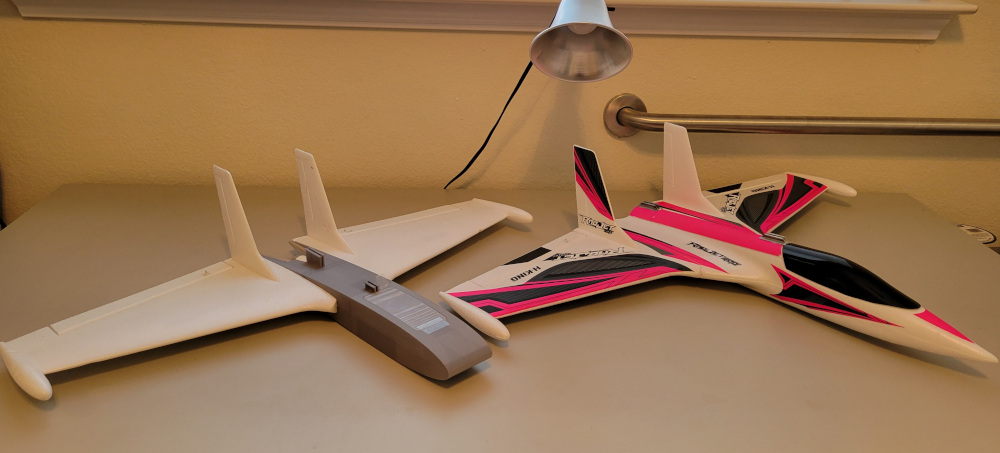
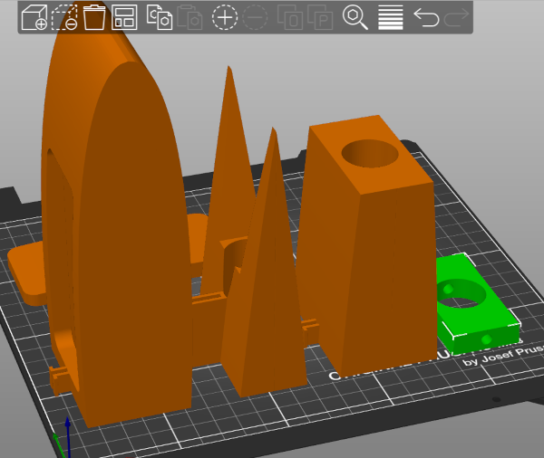

# loose-end: Rocket Glider Research Program

I have a loose end I've been meaning to tie since 2012--a large R/C rocket glider.

Loose End uses wire-cut foam wing cores and a 3D printed fuselage.

First version uses off-the-shelf wings and fins from a HobbyKing RadJet800.
It has a 24mm motor mount.
This version has flown on E9, E15, E6 and F12 motors.

Fuselage prints upright, in sections.
Most pieces use a single perimeter and 2% infill.
Spar carrythrough (green in the image below) uses 30% infill.
This part allows me to cut wing spar in two and the motor to pass through the wing, similar to mid-wing jet flighters like MiG-21 or F-16.

I print these models on a Prusa MK3S+ using Prusament PLA.
I use PrusaSlicer.
Key settings:

* Most fuselage parts are single wall:
  * Permieters: 1
  * Horizontal Shells: top: 3, bottom: 1 (max shell thickness bottom: 0 to force single layer)
  * Infill: 2%
  * Pattern: Rectilinear
  * Max Length of Infill Anchor: 0 (any other values seem to create arbitrarily long anchors; 3mm would be ideal)
  * Brim: outer and inner, 3mm
* Spar carrythrough:
  * Perimeters: 3
  * All other parameters at their defaults
* MMT plug:
  * Fill Pattern: concentric
  * Top Fill Pattern: concentric
  * Bottom Fill Pattern: concentric
  * Brim width: 1.5mm (I leave the brim on; helps align plug in MMT)
