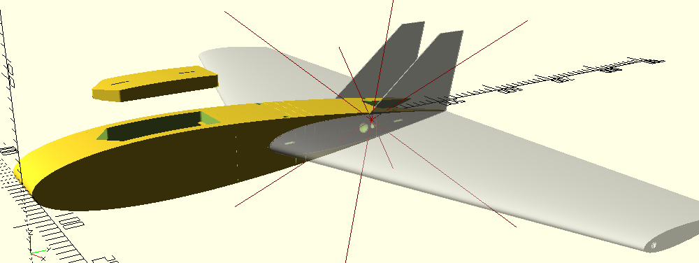
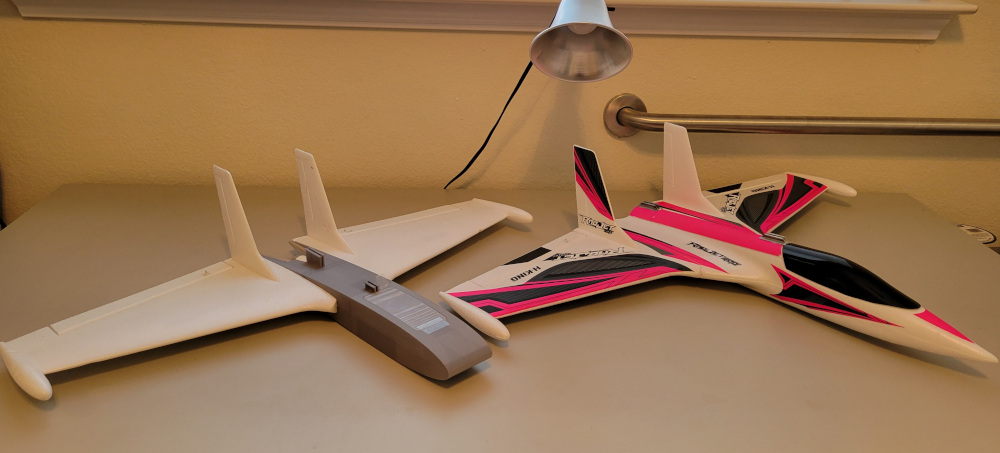
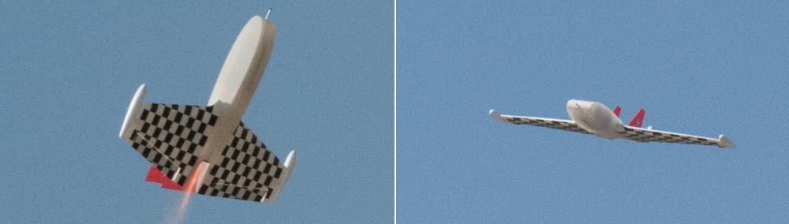
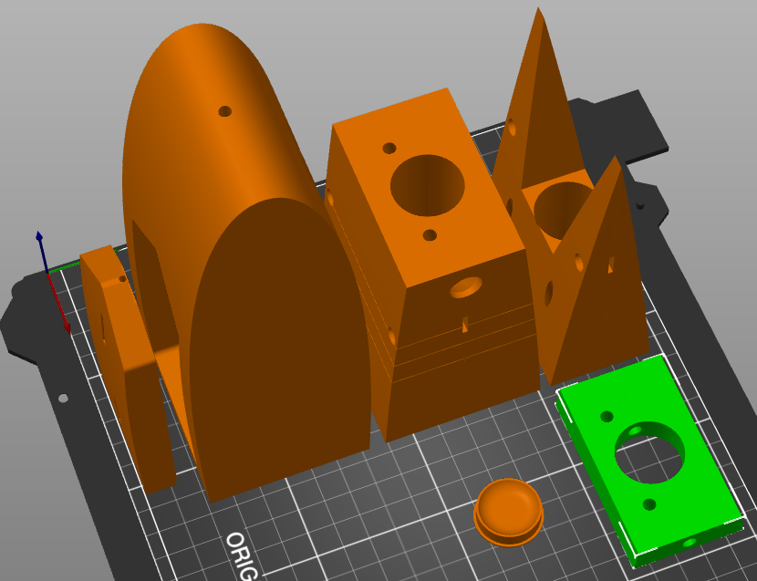

# loose-end: Rocket Glider Research Program

I have a loose end I've been meaning to tie since 2012--a large R/C rocket glider.

Loose End is a family of aircraft.
I use OpenSCAD to define parametric models that can scale from parkflier to giant scale.
A goal of this project is to automate as much of the process as possible to allow for faster iteration of the design.
I use a Makefile to generate individual STLs from the master design, and g-code from the STLs.
Some parts (fins and wing joiner tabs) are in 1.6mm fiberglass (G10); the Makefile generates DXFs for them.

Initial versions use off-the-shelf wings from a HobbyKing RadJet800.
This version has a 24mm motor mount.
This version has flown on E9, E15, E6, E20 and F12 motors.
In January 2023, I am designing printable wings.

Fuselage prints upright, in sections.
Most pieces use a single perimeter and 2% infill.
Spar carrythrough (green in the image below) uses 15% infill.
This part allows me to cut wing spar in two and the motor to pass through the wing, similar to mid-wing jet fighters like MiG-21 or F-16.

I print these models on a Prusa MK3S+ using Prusament PLA.
I use PrusaSlicer in batch mode: [slicer-config](slicer-config) directory holds the INI files I use.
Key settings are:

* Most parts are single wall:
  * Perimeters: 1
  * Horizontal Shells: top: 3, bottom: 1 (max shell thickness bottom: 0 to force single layer)
  * Infill Density: 2%
  * Infill Pattern: Grid
  * Max Length of Infill Anchor: 0 (with some infill patterns, other values create arbitrarily long anchors; 3mm would be ideal)
  * Filament Extra Length on Retract: 0.1mm (helps avoid gaps between infill and perimeters)
  * Brim: outer, 3mm
* Spar carrythrough:
  * Perimeters: 2
  * Infill Density: 15%
  * Infill Pattern: Grid
  * Brim: outer, 3mm
* MMT plug:
  * Fill Pattern: concentric
  * Top Fill Pattern: concentric
  * Bottom Fill Pattern: concentric
  * Brim width: 0mm (the model has its own shoulder)

I make a new tag (release) when I print a new flying aircraft.
Release notes summarize changes from previous version and actual experience with them.

* October 2020: PLA fuselage, RJ wings, G10 fins
* April 2020: first flights, PLA fulseage, RJ wings and fins
